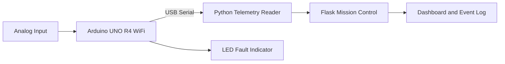

# AURORA-1 Mission Control

AURORA-1 is a CubeSat systems-engineering project that combines spacecraft design, engineering analysis, a browser-based mission-control dashboard, and an Arduino hardware-in-the-loop telemetry prototype.

The local application receives a live analog signal from an Arduino UNO R4 WiFi over USB serial, converts the reading into temperature telemetry, and displays spacecraft status, subsystem health, event logs, and fault alerts. When hardware is unavailable, the application falls back to simulated telemetry so the deployed web demonstration remains usable.

## System Architecture



## Key Features

- Live Arduino telemetry through Python and PySerial
- Analog sensor input mapped to spacecraft temperature
- Physical LED threshold alert for off-nominal conditions
- Flask-based Mission Control dashboard
- Battery, temperature, altitude, mission-mode, and system-status displays
- EPS, ADCS, COMMS, and OBC health monitoring
- Automated warning and fault-management logic
- Mission event logging and telemetry-history charts
- Operator-selectable Science, Communication, and Standby modes
- Automatic simulation fallback when Arduino hardware is unavailable

## Engineering Context

The hardware prototype extends the broader AURORA-1 2U Earth-observation CubeSat design. The digital project includes mission objectives, subsystem requirements, interface definition, verification planning, Fusion 360 spacecraft layout, and orbit, power, thermal, communications, mass, and ADCS analyses.

The potentiometer serves as a controllable test input that represents a spacecraft sensor during hardware-in-the-loop testing. Values above the defined threshold activate the LED and produce a thermal warning in Mission Control.

## Technology Stack

### Hardware

- Arduino UNO R4 WiFi
- Potentiometer
- LED
- 220-ohm resistor
- Breadboard and jumper wires

### Software

- C++ and Arduino IDE
- Python and PySerial
- Flask and Jinja
- HTML, CSS, and JavaScript
- Chart.js
- Git and GitHub

## Project Structure

```text
aurora-1-mission-control/
├── app.py
├── serial_reader.py
├── requirements.txt
├── templates/
│   └── index.html
├── static/
│   └── style.css
└── README.md
```

## Hardware Connections

| Component | Arduino connection |
| --- | --- |
| Potentiometer outer pin | 5V |
| Potentiometer center signal pin | A0 |
| Potentiometer outer pin | GND |
| LED anode through 220-ohm resistor | Digital pin 8 |
| LED cathode | GND |

## Arduino Firmware

```cpp
const int sensorPin = A0;
const int statusLED = 8;
const int threshold = 512;

void setup() {
  pinMode(statusLED, OUTPUT);
  Serial.begin(9600);
}

void loop() {
  int sensorValue = analogRead(sensorPin);

  Serial.println(sensorValue);

  if (sensorValue > threshold) {
    digitalWrite(statusLED, HIGH);
  } else {
    digitalWrite(statusLED, LOW);
  }

  delay(100);
}
```

## Local Setup

1. Clone the repository and enter the project directory.

   ```bash
   git clone https://github.com/chancellorcdelk/aurora-1-mission-control.git
   cd aurora-1-mission-control
   ```

2. Create and activate a Python virtual environment.

   ```bash
   python3 -m venv .venv
   source .venv/bin/activate
   ```

3. Install the dependencies.

   ```bash
   python -m pip install -r requirements.txt
   ```

4. Connect the Arduino and identify its serial port.

   ```bash
   python -m serial.tools.list_ports
   ```

5. Update `ARDUINO_PORT` in `app.py` if the detected port differs from the configured value.

6. Ensure the Arduino Serial Monitor and `serial_reader.py` are closed. Only one program can use the serial port at a time.

7. Start Mission Control.

   ```bash
   python app.py
   ```

8. Open `http://127.0.0.1:5000` in a browser.

## Demonstration Sequence

1. Start the local Flask application with the Arduino connected.
2. Confirm that the dashboard reports `CONNECTED` under Hardware Link.
3. Rotate the potentiometer and observe the raw input and temperature change.
4. Cross the midpoint threshold to activate the physical LED.
5. Observe the Thermal Warning, OBC warning state, event-log entry, and temperature-history response.
6. Disconnect the Arduino to demonstrate automatic simulation fallback.

## Deployment Note

The hosted web version demonstrates the Mission Control interface using simulated telemetry. Direct Arduino telemetry is available in the local version because cloud hosting cannot access a USB device connected to the operator's computer.

## Future Development

- Replace the potentiometer with physical temperature and environmental sensors
- Add bidirectional commands from Mission Control to the Arduino
- Store telemetry in a persistent database
- Add packet timestamps, validation, and communication-loss detection
- Expand hardware interfaces for additional CubeSat subsystems

## Author

Chancellor Delk  
Mechatronics Engineering student at Middle Tennessee State University
